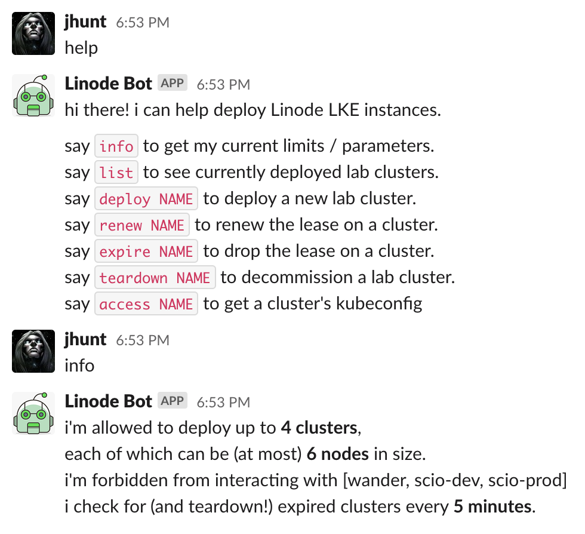
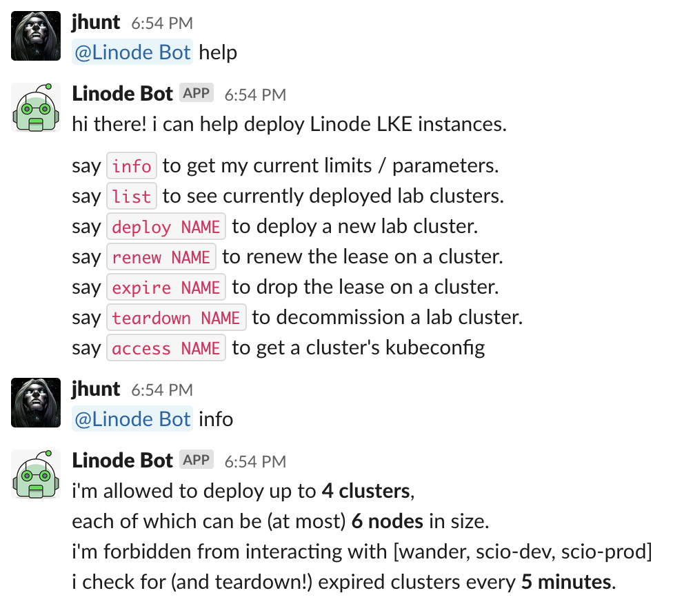
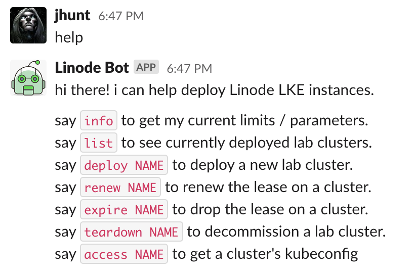
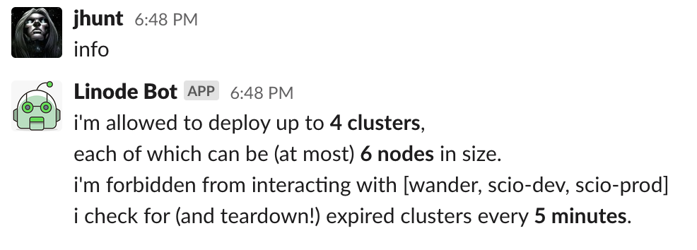
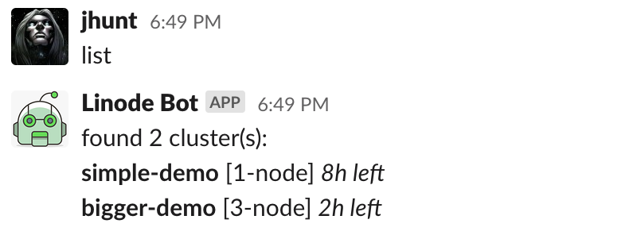
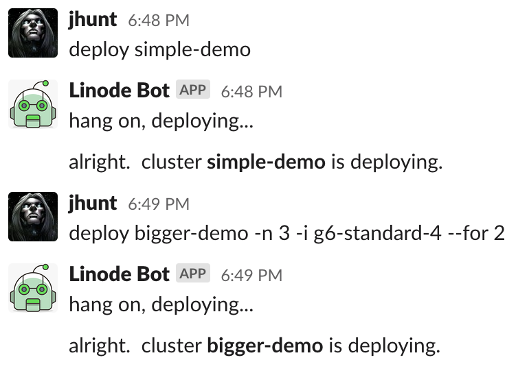
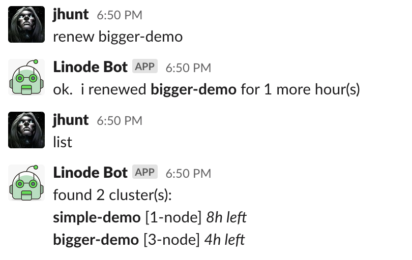
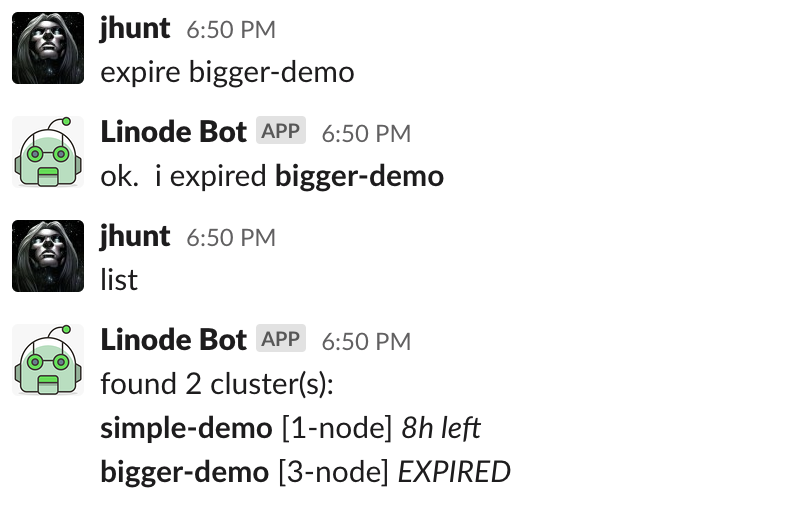
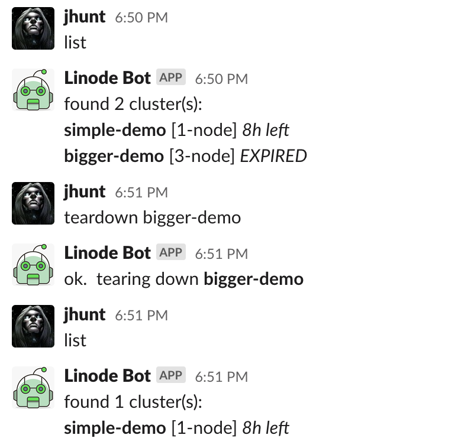
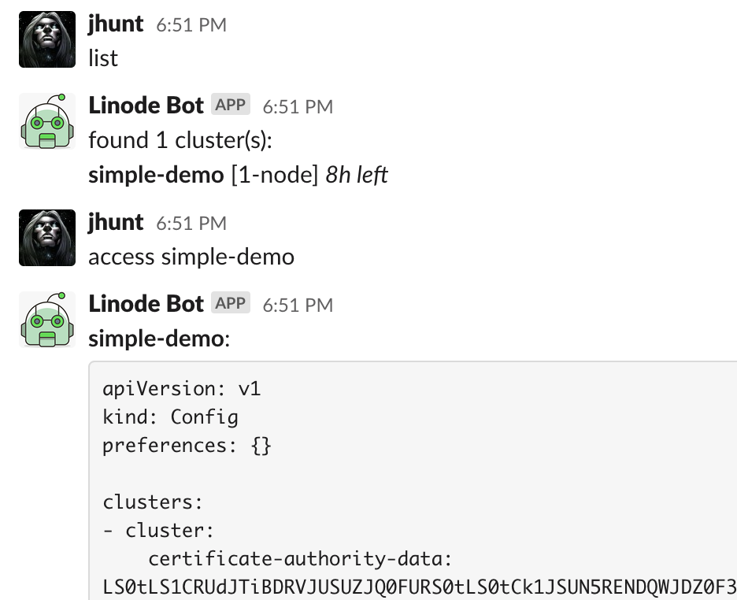

LKEBot -  A Slack Bot for Deploying Lab LKE Clusters
====================================================

This is a Slack Bot for managing a dynamic fleet of
[Linode LKE][1] clusters, with an upper limit on deployment counts
and sizing, geared towards chat-ops teams who want short-lived,
ephemeral Kubernetes clusters for testing and deployment.

Running the Bot
---------------

To run the bot manually, first build the software:

    go build .

and then execute the resulting `lkebot` binary, with the
appropriate flags:

    ./lkebot --slack $SLACK_TOKEN --linode $LINODE_TOKEN

To run this in Docker, you can use the [filefrog/lkebot][2] image,
and your foavorite orchestrator / command-line flags:

    docker run --rm -d \
      -e LKEBOT_LINODE_TOKEN=$LINODE_TOKEN \
      -e LKEBOT_SLACK_TOKEN=$SLACK_TOKEN \
      filefrog/lkebot:latest

For Kubernetes deployments, we have a sample YAML file, in
`k8s/deploy.yml`; modify that how you see fit (namespace and
configuration), and then apply it:

    kubectl apply -f k8s/deploy.yml

Interaction
-----------

In direct one-on-one messages, commands can be sent as-is:

If you invite the bot to a channel, channel members will be able
to interact with it by prefixing the command with a lone @-name:

The following commands are known:

  - `help` - Print a helpful message about known commands.
  - `info` - Print the chatbots configuration.
  - `list` - Print the list of currently deployed clusters.
  - `deploy ...` - Deploy a new cluster.
  - `renew ...` - Renew the lease on a cluster.
  - `expire ...` - Immediately release the lease on a cluster.
  - `teardown ...` - Immediately delete a cluster.
  - `access ...` - Retrieve the $KUBECONFIG for a cluster.

### help

Prints out a helpful reminder of how to interact with the chatbot.

This command takes no arguments.

### info

Prints out the chatbot configuration, including defaults and upper
limits.

This command takes no arguments.

### list

Queries the Linode API (caching the results) and then prints out
the current status of deployed clusters, their sizing, and
expiration times (relatively speaking).

This command takes no arguments.

### deploy

Deploys a new LKE Kubernetes cluster.

Usage:

    deploy NAME [-v K8S-VERSION] [-r REGION] [-i INSTANCE] [-n NODES] [--for HOURS]

The following flags are defined:

  - `-v` or `--version` - The version of Kubernetes to deploy.

  - `-r` or `--region` - The name of the Linode region to deploy
    the LKE cluster into.  This region *must* support
    "Kubernetes".

  - `-i` or `--using` - The name of the Linode instance type to
    deploy in this cluster's node pool.

  - `-n` or `--nodes` - How many worker nodes (pursuant to
    operator-imposed upper limits) to deploy.

  - `--for` - How long (in hours) should this cluster live.

If any or all of these options are omitted, suitable built-in and
operator-provided defaults are used.

### renew

Renew the lease on a deployed cluster.

Usage:

    renew NAME [--for HOURS]

The following flags are defined:

  - `--for` - How many more hours to add onto the clusters lease.
    If not specified, defaults to `1` (hour).

### expire

Immediately expires a cluster's lease, making it sweepable
(without explicitly tearing it down).

Usage:

    expire NAME

This command takes no additional arguments.

### teardown

Immediately tear down a cluster, deleting its worker nodes, and
obliterating all workloads running on it.

Usage:

    teardown NAME

This command takes no additional arugments

### access

Retrieves and prints a suitable KUBECONFIG for accessing this
cluster via the `kubectl` CLI.

Usage:

    access NAME

This command takes no additional arugments

Configuration
-------------

You can configure the bot via either command-line flags or
environment variables.  Here's the list of knobs and levers you
can fiddle with:

  - `$LKEBOT_SLACK_TOKEN`, or `--slack` - *REQUIRED* - Sets the
    Slack API token that the chatbot will use to chat.

  - `$LKEBOT_LINODE_TOKEN` or `--linode` - *REQUIRED* - Sets the
    Linode API token that the chatbot will use to deploy and tear
    down LKE clusters.

  - `$LKEBOT_SWEEP_INTERVAL` or `--sweep` - Sets the interval, in
    minutes, that the bot should look for expired clusters, and
    schedule their decommission.  Defaults to `1`; setting it to
    `0` effectively disables sweep logic.

  - `$LKEBOT_CHANNEL` or `--channel` - Sets the name of the
    channel to report expired cluster teardown to.  Has no effect
    if sweeping is disabled.  If you set this to the empty string
    (which also happens to be the default), sweep messages will
    be printed to stdout, instead of to Slack.

  - `$LKEBOT_MAX_CLUSTERS` or `--max-clusters` - An upper limit on
    how many LKE clusters this chatbot is allowed to deploy.
    Defaults to `5`.

  - `$LKEBOT_MAX_NODES` or `--max-nodes` - An upper limit on how
    big of an LKE cluster this chatbot is allowed to deploy.
    Defaults to `5`.

  - `$LKEBOT_DEFAULT_REGION` or `--default-region` - What Linode
    region should clusters be deployed to if no explicit region is
    set?  Defaults to `us-east`; make sure the region you choose
    has "Kubernetes" available.

  - `$LKEBOT_DEFAULT_INSTANCE` or `--default-instance` - What
    Linode instance type to use in the node pool for new clusters.
    Defaults to `g6-standard-2`; make sure the instance type you
    choose actually exists.

  - `$LKEBOOT_DEFAULT_SIZE` or `--default-size` - How large of a
    cluster should the chatbot deploy, if no size is explicitly
    set?  Must not execeed the set upper limit for cluster size.

  - `$LKEBOT_DEFAULT_K8S_VERSION` or `--default-k8s-version` -
    What version of Kubernetes should the chatbot deploy, when not
    told expressly which to use?  Defaults to `1.18`; make sure
    the version you specify is known to Linode / LKE.

  - `$LKEBOT_BLACKLIST_CLUSTERS` or `--blacklist` - One (or more)
    cluster names to explicitly prohibit the chatbot from
    touching.  The command-line flag can be set multiple times;
    the environment variable is a comma- or space-separated list.
    This hs no effect of sweeping is disabled.

[1]: https://www.linode.com/products/kubernetes/
[2]: https://hub.docker.com/r/filefrog/lkebot
